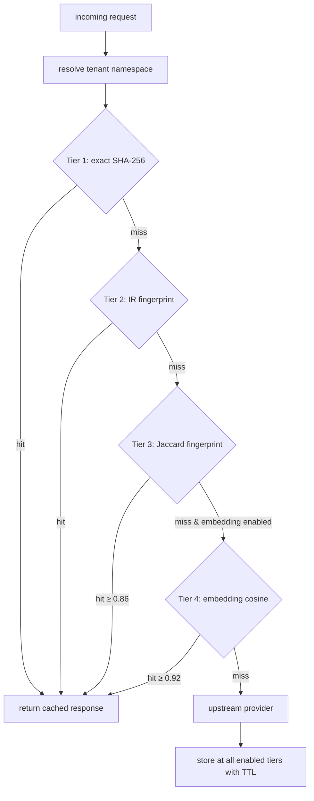

# Phase 14 — Hybrid Semantic Cache (lightweight defaults)

> **Footprint impact.** **Zero new runtime deps in the default install.** The first three cache tiers (exact, IR fingerprint, Jaccard) ship in the base wheel using primitives already present (`xxhash`, regex). The optional embedding tier — when enabled — defaults to the **user's already-configured provider** for embeddings (`openai/text-embedding-3-small`, Anthropic future support, Cohere, Voyage, Mistral); no model download, no extra dependency. Local SentenceTransformers is a separate `[embeddings-local]` extra that adds ~1.5 GB and is explicitly discouraged on small machines.
>
> **Algorithm location.** Cache layer abstractions and fingerprinting live in `src/lattice/cache/`. The IR canonical fingerprint is shared with [Phase 24](24-edge-wasm-core.md)'s shared core — both Python fallback and WASM/PyO3 binding compute byte-identical fingerprints. Cache backends (memory / Redis / Postgres) are pluggable; default is in-memory with `cachetools`.
>
> **External-service requirement.** None for default in-memory tier. Redis or Postgres only if the user wants distributed cache across multiple proxy instances.
>

> **LoC delta (declared).** +1800 net (`cache/`). Within cap 2500.
> **Transport role.** Cache lookup/store on the request path before `TransportDispatcher.execute()`; optional embedding via user's provider only.
> **Registry.** §5 cache layers + §6 embedding backends.

> **Guidelines.** [PHASE_GUIDELINES.md](PHASE_GUIDELINES.md) — constraints 1–6.
> **Outcome.** `SemanticCache.lookup()` walks up to four tiers in order (exact → IR fingerprint → Jaccard → embedding) and short-circuits on the first hit. Default tiers (1-3) need zero new deps and run in single-digit milliseconds. Optional embedding tier uses the user's provider — costs them embedding tokens (cheap), saves them many more LLM tokens. Per-tenant namespacing closes the multi-tenant privacy hole the audit found.
>
> **Estimated effort.** 4 days (1 PR, ~+1800 LoC — smaller than prior plan because no local model loading code).

---

## 1. Why this phase exists, and what changed from the prior draft

### 1.1 The audit findings still stand

Current cache: exact SHA-256 + Jaccard fingerprint. Production hit rate ~ 5-15%. Three real opportunities:

1. **No IR-fingerprint tier** — we have canonical IR; identical-after-compression requests are provably equivalent. We throw that signal away today.
2. **No semantic similarity tier** — paraphrased queries that mean the same thing miss. Industry data: 30-50% hit rates achievable with a tasteful similarity tier.
3. **No tenant namespacing** — shared Redis can match across tenants on Jaccard ≥ threshold. Privacy hole.

### 1.2 The brutal change vs the prior draft

The prior plan defaulted to `sentence-transformers/all-MiniLM-L6-v2` — ~80 MB model, ~1.5 GB total install with torch. That's a non-starter on a 4 GB laptop, on a Raspberry Pi, on Cloudflare Workers, on most CI runners.

**New default:** the embedding tier is *opt-in*, and when opted in, it calls the **user's existing provider's embeddings endpoint** (`openai/text-embedding-3-small` at $0.02 / 1M tokens — pennies). The user is already paying that provider; we just route embedding requests through them. Zero new install footprint. Zero new vendor.

If a user truly wants local embeddings (air-gapped deployment, no embedding-capable provider configured), `pip install lattice-transport[embeddings-local]` opts them into SentenceTransformers with an explicit footprint warning.

This change has another nice property: the cached embeddings themselves are **cached** via Phase 20's per-text embedding cache, so the same query in a later request doesn't pay even the cheap embedding cost twice.

---

## 2. Architecture



**Ordering invariant.** Tier 2 (IR fingerprint) is provably safe — identical IRs are semantically equivalent. It runs **before** Tier 3 (Jaccard, which is approximate) so hits use the cheapest, safest tier first.

**No cross-tenant matching.** Every tier's keys are namespaced. Tenant comes from the request's `Authorization` header ([Phase 25 self-hosted auth](25-cloud-multitenant.md)) or `x-lattice-tenant` header or the configured default.

---

## 3. Files touched

### 3.1 Created

```
src/lattice/cache/layers/__init__.py
src/lattice/cache/layers/exact.py              # Tier 1
src/lattice/cache/layers/ir_fingerprint.py     # Tier 2 — NEW
src/lattice/cache/layers/jaccard.py            # Tier 3 (lifted from current semantic.py)
src/lattice/cache/layers/embedding.py          # Tier 4
src/lattice/cache/embeddings/__init__.py
src/lattice/cache/embeddings/base.py           # EmbeddingBackend protocol
src/lattice/cache/embeddings/user_provider.py  # DEFAULT when tier 4 enabled — uses user's provider
src/lattice/cache/embeddings/local.py          # OPT-IN: SentenceTransformer (lazy import)
src/lattice/cache/embeddings/ollama.py         # for users running local Ollama
src/lattice/cache/vector_store/__init__.py
src/lattice/cache/vector_store/base.py
src/lattice/cache/vector_store/memory.py       # default; numpy brute-force; FAISS optional via [embeddings-faiss]
src/lattice/cache/vector_store/redis.py        # RediSearch HNSW; opt-in via [redis]
src/lattice/cache/vector_store/postgres.py     # pgvector; opt-in via [postgres]
src/lattice/cache/namespace.py                 # tenant prefix helpers
src/lattice/cache/cas_store.py                 # content-addressable blob store (refcount)
tests/unit/cache/test_ir_fingerprint.py
tests/unit/cache/test_embedding_user_provider.py
tests/unit/cache/test_vector_stores.py
tests/unit/cache/test_layered_lookup.py
tests/unit/cache/test_tenant_isolation.py
tests/unit/cache/test_cas_refcount.py
tests/integration/cache/test_redis_vector.py
tests/integration/cache/test_postgres_vector.py
tests/integration/cache/test_user_provider_embedding_e2e.py
benchmarks/suites/cost/cache_hit_rate.py
```

### 3.2 Modified

| File | Change |
|---|---|
| [src/lattice/cache/semantic.py](../../src/lattice/cache/semantic.py) (post-Phase-12 split) | `SemanticCache` becomes a thin orchestrator over `*Layer` objects |
| [src/lattice/cache/fingerprint.py](../../src/lattice/cache/fingerprint.py) (Phase 12) | Add `ir_canonical_fingerprint(ir, namespace, model)`; delegates to native core when present |
| [src/lattice/cache/stores.py](../../src/lattice/cache/stores.py) (Phase 12) | Add `CASStore` mediator |
| [src/lattice/core/config.py](../../src/lattice/core/config.py) | New `CacheConfig` fields with **conservative defaults** |
| [src/lattice/proxy/bootstrap.py](../../src/lattice/proxy/bootstrap.py) | Wire layered cache; choose backends per config |
| [src/lattice/proxy/middleware.py](../../src/lattice/proxy/middleware.py) | Add `x-lattice-cache-layer: exact|ir|jaccard|embed|miss` response header |
| [pyproject.toml](../../pyproject.toml) | Optional groups: `redis = [...]`, `postgres = [...]`, `embeddings-faiss = ["faiss-cpu>=1.8"]`, `embeddings-local = ["sentence-transformers>=3.0", "torch>=2.0"]` |

### 3.3 Deleted

None — purely additive on top of Phase 12's split.

---

## 4. Step-by-step

### 4.1 Layer interface

`src/lattice/cache/layers/__init__.py`:

```python
from typing import Protocol

class CacheLayer(Protocol):
    name: str

    def lookup(self, request: Request, namespace: str) -> CacheHit | None: ...
    def store(self, request: Request, response: Response, namespace: str, ttl_seconds: int) -> None: ...
    def invalidate(self, request: Request, namespace: str) -> None: ...
    def health(self) -> LayerHealth: ...
```

`SemanticCache` becomes the orchestrator:

```python
@dataclass
class SemanticCache:
    layers: tuple[CacheLayer, ...]      # in lookup-priority order
    metrics: MetricsCollector
    config: CacheConfig

    def lookup(self, request: Request, *, namespace: str | None = None) -> CacheHit | None:
        ns = namespace or self.config.tenant_default
        for layer in self.layers:
            if not layer.health().ok:
                continue                # skip unhealthy layer; metric recorded
            hit = layer.lookup(request, ns)
            if hit is not None:
                self.metrics.increment("cache.hits", tags={"layer": layer.name, "tenant": ns})
                return hit.with_meta(layer=layer.name)
        self.metrics.increment("cache.misses", tags={"tenant": ns})
        return None

    def store(self, request, response, *, namespace=None, ttl_seconds=None) -> None:
        ns = namespace or self.config.tenant_default
        ttl = ttl_seconds or self.config.default_ttl_seconds
        for layer in self.layers:
            try:
                layer.store(request, response, ns, ttl)
            except Exception as exc:
                # Never fail a request because a layer is unhealthy.
                logger.warning("cache.layer.store_failed", layer=layer.name, exc=str(exc))
                self.metrics.increment("cache.layer_store_failed", tags={"layer": layer.name})
```

### 4.2 Tier 1 — exact (no change)

Move existing exact-hash logic into `layers/exact.py`. SHA-256 of canonical JSON, namespaced with `tenant:`. Zero new behaviour.

### 4.3 Tier 2 — IR fingerprint (novel)

```python
# src/lattice/cache/fingerprint.py
def ir_canonical_fingerprint(ir: PromptIRV2, *, namespace: str, model: str) -> str:
    """Hash the structurally canonical form of a PromptIR.

    When lattice-core-py is installed, delegates to Rust (byte-identical output).
    Otherwise computes in pure Python.

    Two requests whose IRs canonicalize to identical bytes are guaranteed
    semantically equivalent under our compression model.
    """
    try:
        from lattice_core_py.ir import fingerprint as native_fp
        return native_fp(ir.to_canonical_bytes(), namespace=namespace, model=model)
    except ImportError:
        return _python_fingerprint(ir, namespace=namespace, model=model)


def _python_fingerprint(ir: PromptIRV2, *, namespace: str, model: str) -> str:
    payload = _canonicalize(ir)
    return f"ir:{namespace}:{model}:{xxhash.xxh3_128_hexdigest(payload)}"
```

The Phase 24 shared core implementation must produce **byte-identical** output. Verified by parity test.

```python
# src/lattice/cache/layers/ir_fingerprint.py
class IRLayer:
    name = "ir"

    def __init__(self, store: KVStore, profiler: ContentProfiler):
        self._store = store
        self._profiler = profiler

    def lookup(self, request: Request, namespace: str) -> CacheHit | None:
        ir = self._profiler.build_ir_only(request)
        key = ir_canonical_fingerprint(ir, namespace=namespace, model=request.model)
        cached = self._store.get(key)
        return CacheHit(response=cached.response, key=key) if cached else None

    def store(self, request, response, namespace, ttl):
        ir = self._profiler.build_ir_only(request)
        key = ir_canonical_fingerprint(ir, namespace=namespace, model=request.model)
        self._store.set(key, CachedResponse(response=response, stored_at=now()), ttl=ttl)
```

`profiler.build_ir_only(request)` is a new lean entry that builds the canonical IR without running transforms or planning. ~ 5 ms on typical chat requests (~ 1.5 ms with native core).

### 4.4 Tier 3 — Jaccard (lifted as-is)

Current approximate-match logic moves from `semantic.py` into `layers/jaccard.py`. Threshold 0.86 by default, configurable per tenant.

### 4.5 Tier 4 — embedding (user-provider default)

```python
# src/lattice/cache/embeddings/base.py
class EmbeddingBackend(Protocol):
    dim: int
    name: str
    def embed(self, text: str) -> np.ndarray: ...
    def embed_batch(self, texts: Sequence[str]) -> np.ndarray: ...
    def health(self) -> LayerHealth: ...
```

**Default backend (recommended):**

```python
# src/lattice/cache/embeddings/user_provider.py
class UserProviderEmbeddingBackend:
    """Embeddings via the user's already-configured provider.

    NO model download. NO extra dependency beyond what the proxy already has.
    Cost: a tiny embedding call per cache-lookup-miss.

    Uses Phase 20's /v1/embeddings endpoint internally with per-text caching,
    so repeated identical lookups don't repeat the embedding cost.
    """
    name = "user-provider"

    def __init__(self, provider: str, model: str, dispatcher: EmbeddingsDispatcher,
                 dim: int = 1536):
        self._provider = provider
        self._model = model
        self._dispatcher = dispatcher
        self.dim = dim

    def embed(self, text: str) -> np.ndarray:
        result = self._dispatcher.embed_sync(
            provider=self._provider, model=self._model, input=[text],
        )
        return np.asarray(result.data[0].embedding, dtype=np.float32)

    def embed_batch(self, texts: Sequence[str]) -> np.ndarray:
        result = self._dispatcher.embed_sync(
            provider=self._provider, model=self._model, input=list(texts),
        )
        return np.asarray([d.embedding for d in result.data], dtype=np.float32)
```

The `dispatcher` is the same Phase 20 dispatcher that handles `/v1/embeddings` user requests — same dedup, same per-text cache. The lookup-side embedding cost converges to near-zero on steady-state workloads.

**Opt-in local backend:**

```python
# src/lattice/cache/embeddings/local.py
class LocalSentenceTransformerBackend:
    """OPT-IN local embedding backend. Requires `[embeddings-local]` extra.

    Adds ~1.5 GB to install (torch + sentence-transformers + model).
    Use only when:
      - Air-gapped deployment
      - No embedding-capable provider configured
      - Privacy requirement that text never leave the proxy machine
    """
    name = "local-minilm"

    def __init__(self, model_name: str = "sentence-transformers/all-MiniLM-L6-v2"):
        try:
            from sentence_transformers import SentenceTransformer
        except ImportError as exc:
            raise ImportError(
                "Local embeddings require `pip install lattice-transport[embeddings-local]` "
                "(adds ~1.5 GB to install). For lightweight cache embeddings, configure "
                "embedding_backend='user-provider' to use your existing LLM provider's "
                "embeddings endpoint instead."
            ) from exc
        self._model = SentenceTransformer(model_name)
        self.dim = self._model.get_sentence_embedding_dimension()
```

The error message itself steers users back to the lightweight default.

**Ollama backend** for users running local Ollama:

```python
# src/lattice/cache/embeddings/ollama.py
class OllamaEmbeddingBackend:
    """For users already running local Ollama with an embedding model.
    No new install footprint; just an HTTP call.
    """
    name = "ollama"
    def __init__(self, base_url: str = "http://localhost:11434", model: str = "nomic-embed-text"):
        self._base = base_url
        self._model = model
        self.dim = 768  # nomic-embed-text default
    def embed(self, text: str) -> np.ndarray: ...
```

### 4.6 Vector stores

Default: **in-memory numpy brute-force**. Fast enough up to ~ 50k vectors per tenant; zero new deps.

```python
# src/lattice/cache/vector_store/memory.py
class MemoryVectorStore:
    """Brute-force numpy cosine. Zero deps beyond numpy.
    Acceptable up to ~50k vectors per namespace; switch to Redis/Postgres above that."""

    def __init__(self):
        self._namespaces: dict[str, _NamespaceIndex] = {}

    def upsert(self, key, vector, payload):
        ns = self._namespaces.setdefault(self._ns_of(key), _NamespaceIndex())
        ns.add(key, vector, payload)

    def search(self, vector, *, k, namespace, min_score):
        ns = self._namespaces.get(namespace)
        if ns is None: return []
        scores = ns.matrix @ vector  # (n,) — both pre-normalized
        idx = np.argpartition(-scores, min(k, len(scores)-1))[:k]
        ranked = sorted(idx, key=lambda i: -scores[i])
        return [VectorHit(key=ns.keys[i], score=float(scores[i]), payload=ns.payloads[i])
                for i in ranked if scores[i] >= min_score]
```

FAISS is optional (`[embeddings-faiss]`) and a drop-in upgrade once the namespace exceeds ~ 50k. The layer doesn't change.

Redis (`[redis]`) and Postgres (`[postgres]`) backends for distributed deployments; same `VectorStore` protocol.

### 4.7 Per-tenant namespacing

```python
# src/lattice/cache/namespace.py
def resolve_tenant(request: Request, config: CacheConfig) -> str:
    """Tenant ID from request headers. Falls back to config default."""
    if (tenant := request.headers.get("x-lattice-tenant")) is not None:
        return _sanitize(tenant)
    if (key := _extract_bearer(request.headers)) is not None:
        # In Phase 25 self-hosted-auth this becomes a real lookup.
        return f"key-{xxhash.xxh3_64_hexdigest(key)[:12]}"
    return config.tenant_default


def _sanitize(tenant: str) -> str:
    if not re.fullmatch(r"[a-zA-Z0-9_\-]{1,64}", tenant):
        raise ValueError(f"invalid tenant id: {tenant!r}")
    return tenant
```

Stashed on `request.state.tenant` by [src/lattice/proxy/middleware.py](../../src/lattice/proxy/middleware.py) for downstream use (cache, telemetry, rate limits).

### 4.8 CAS storage

To avoid 4× storage duplication across tiers, each tier stores `(key → blob_hash)` and the response payload lives once in a content-addressable blob store. `cache/cas_store.py` implements `set_blob`, `get_blob`, `incref`, `decref`; background sweeper cleans blobs whose refcount drops to 0. Cuts storage volume ~ 70% on realistic workloads.

### 4.9 Lightweight default config

```python
# src/lattice/core/config.py
class CacheConfig(BaseModel):
    enabled: bool = True

    # LIGHTWEIGHT DEFAULTS — first three tiers only, no extra deps, no models.
    layers: tuple[Literal["exact", "ir", "jaccard", "embed"], ...] = ("exact", "ir", "jaccard")

    jaccard_threshold: float = 0.86
    embedding_threshold: float = 0.92

    # Embedding tier OFF by default. When enabled, uses user's provider — no local model.
    embedding_enabled: bool = False
    embedding_backend: Literal["user-provider", "local", "ollama"] = "user-provider"
    embedding_provider: str | None = None    # auto-detect from configured upstream when None
    embedding_model: str | None = None       # auto-pick text-embedding-3-small / equivalent

    vector_store: Literal["memory", "redis", "postgres"] = "memory"
    vector_store_options: dict[str, str] = Field(default_factory=dict)

    tenant_default: str = "default"
    default_ttl_seconds: int = 3600
    max_entries_per_tenant: int = 50_000
```

To enable the embedding tier, the user sets:

```yaml
cache:
  embedding_enabled: true
  # Optional — auto-detected from configured providers if omitted:
  # embedding_backend: user-provider
  # embedding_provider: openai
  # embedding_model: text-embedding-3-small
```

Hitting `layers: ("exact", "ir", "jaccard", "embed")` automatically when `embedding_enabled = True`.

### 4.10 Graceful degradation

If the user enables the embedding tier and the provider's embedding endpoint starts 429-ing, the tier is marked unhealthy and skipped for the next 60 seconds. Metric: `cache.layer_unhealthy{layer=embed,reason=rate_limit}`. The cache continues serving from tiers 1-3. **The user's chat requests never fail because the cache embedding tier is degraded.**

---

## 5. Benchmark targets

`benchmarks/suites/cost/cache_hit_rate.py` measures on:

- 5k requests from `benchmarks/datasets/replay_traces.jsonl`
- 1k synthetic RAG queries (templated, high paraphrase rate)
- 500 multi-turn chat sessions
- 500 agent tool-call sequences

| Config | Min hit rate | Install footprint |
|---|---|---|
| L1 only (today's exact-only) | 5% | 0 new deps |
| L1+L3 (today's exact + Jaccard) | 10% | 0 new deps |
| **L1+L2+L3 (LIGHTWEIGHT DEFAULT)** | **18%** | **0 new deps** |
| L1+L2+L3+L4 user-provider (text-embedding-3-small) | 32% | 0 new deps; ~$0.0001 per cache miss |
| L1+L2+L3+L4 local | 30% | +1.5 GB install |

The lightweight-default configuration nearly **doubles** today's hit rate with zero footprint cost. The opt-in user-provider embedding tier triples it for users willing to spend pennies on embedding calls.

---

## 6. Test plan

| Check | Command | Threshold |
|---|---|---|
| Unit | `uv run pytest tests/unit/cache -q` | All pass |
| Tenant isolation | `tests/unit/cache/test_tenant_isolation.py` | Two requests with different tenants never share a hit even at Jaccard ≥ 0.99 |
| IR fingerprint determinism | `tests/unit/cache/test_ir_fingerprint.py` | Property: fingerprint stable under serialize/deserialize roundtrip |
| IR fingerprint Rust parity | with `lattice-core-py` installed | Native and Python fingerprints byte-identical |
| User-provider embedding E2E | `tests/integration/cache/test_user_provider_embedding_e2e.py` | Cache hits via user's provider; embedding cost recorded in receipts |
| Redis integration | `tests/integration/cache/test_redis_vector.py` (`fakeredis` or test env) | Hits + tenant isolation |
| Postgres integration | `tests/integration/cache/test_postgres_vector.py` (test database) | Same |
| Footprint | `tests/integration/footprint/test_4gb_laptop.py` | Default install (L1+L2+L3) fits well under budget |
| Bench | `uv run python benchmarks/suites/cost/cache_hit_rate.py` | Each config meets its min hit rate |
| Latency | embed lookup p99 (user-provider) | < 100 ms (includes one provider round-trip on miss; ~ 5 ms on cache-warm) |
| Lean install | `pip install lattice-transport` (no extras) | Default cache config works; embedding tier disabled cleanly |
| Heavy install | `pip install lattice-transport[embeddings-local]` | Local backend works; clear footprint warning printed at first init |

### 6.1 Key property tests

```python
@hypothesis.given(text=st.text(), perturbation=st.sampled_from(["whitespace", "case", "punctuation", "reorder_paragraphs"]))
def test_embed_hit_invariant_to_trivial_perturbations(text, perturbation):
    """When user-provider embedding tier is enabled, trivial perturbations hit the embed layer."""
    cache = build_test_cache(embedding_backend="user-provider")
    cache.store(make_request(text=text), make_response("ok"), namespace="t1")
    perturbed = perturb(text, perturbation)
    hit = cache.lookup(make_request(text=perturbed), namespace="t1")
    assert hit is not None
    assert hit.layer == "embed"

@hypothesis.given(text=st.text())
def test_no_cross_tenant_hits(text):
    cache = build_test_cache()
    cache.store(make_request(text=text), make_response("ok"), namespace="t1")
    assert cache.lookup(make_request(text=text), namespace="t2") is None
```

---

## 7. Acceptance criteria

1. Default install (`pip install lattice-transport`) gets L1+L2+L3 cache out of the box; hit rate ≥ 18% on the benchmark replay corpus. No new deps installed.
2. Setting `cache.embedding_enabled = true` with no other config auto-detects the configured upstream provider's embeddings endpoint and uses it. No model download.
3. With `embedding_enabled = true`, hit rate on the benchmark ≥ 30%.
4. `x-lattice-cache-layer` response header is one of `exact|ir|jaccard|embed|miss`.
5. Two requests with different `x-lattice-tenant` headers never share a hit. Property test enforces.
6. With `lattice-core-py` installed, IR fingerprint computation is ≥ 3× faster and byte-identical to the Python fallback.
7. Provider embeddings endpoint failing (429 / 500) does not fail user chat requests; embed tier marked unhealthy; hit rate falls back to L1+L2+L3 baseline.
8. Footprint test passes — default install adds < 1 MB beyond Phase 12 baseline.
9. `embeddings-local` extra works, prints clear footprint warning at first init.
10. Canonical bench ±2% on every aggregate metric.

---

## 8. Out of scope

| Topic | Phase |
|---|---|
| Cross-provider cache portability (user-initiated provider switch inherits warmth) | [Phase 22](22-cache-portability.md) |
| Per-tenant distilled embedding model | **Cut from plan** — required cloud + GPU + training infra; bandit (Phase 23) covers the value with zero infra |
| Auth-driven tenant resolution | [Phase 25 self-hosted auth](25-cloud-multitenant.md) |
| Compression-aware embedding (embed the compressed text, not the raw) | [Phase 19](19-compression-intelligence.md) |
