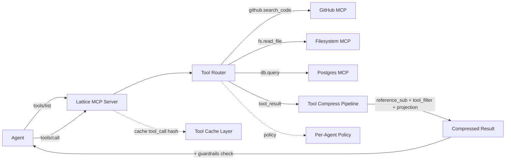

# Phase 21 — MCP-Native Gateway

> **Footprint impact.** Zero new runtime deps. MCP transport (stdio + Streamable HTTP) reuses the existing FastAPI + httpx the proxy already depends on. Tool-output compression reuses the existing transform pipeline. Tool-call cache reuses [Phase 20](17-hybrid-semantic-cache.md)'s layered cache. Guardrails reuse [Phase 21](18-native-guardrails.md). Adds ~ 8 MB to install (the MCP module itself).
>
> **Algorithm location.** New `src/lattice/mcp/` package owns the MCP protocol surface (federation, dispatch, registry, upstream transports). All compression / cache / guardrail work delegates to existing modules — no duplication. SDKs in [Phase 19](16-python-sdk-quality.md) / [Phase 24](20-typescript-sdk.md) are not involved; agents talk to `lattice mcp serve` over the MCP protocol directly.
>
> **External-service requirement.** None for serving. Federated upstream MCP servers (the user's own configured tools) are the only "external services" — chosen by the user, not imposed by us.
>

> **Transport role.** MCP is an alternate ingress into the same pipeline + transport dispatcher as HTTP proxy.
> **Registry.** §13 MCP.

> **Guidelines.** [PHASE_GUIDELINES.md](PHASE_GUIDELINES.md) — constraints 1–6.
> **Goal.** LATTICE becomes the universal MCP endpoint. Any agent (Claude Code, Cursor, Goose, custom) points at a single `lattice mcp serve` URL; we federate all configured upstream MCP servers, route tool calls through the compression pipeline, cache tool results, and apply guardrails — all without any per-agent configuration.
>
> **Outcome.** A new `lattice/mcp/` package and a `lattice mcp` CLI subtree. `lattice mcp serve --config mcp-servers.yaml --port 1975` exposes a fully spec-compliant MCP server. `lattice mcp add github https://github-mcp.example.com` registers an upstream server. Tool call results pass through `reference_sub`, `tool_filter`, `tool_projection`, and (optional) `rate_distortion` before being returned to the agent — the largest single source of agent-context bloat shrinks dramatically. Tool call responses are cached by (server, tool, arg-hash). Guardrails ([Phase 21](18-native-guardrails.md)) scan tool output (the #1 injection vector). `lattice lace claude --mcp` auto-configures the agent to use the federation endpoint.
>
> **Estimated effort.** 7 days (1 PR, ~+3500/-200 LoC).

---

## 1. Why this phase exists

MCP (Model Context Protocol) is the 2025-2026 standard for connecting tools to agents. Today every agent has its own MCP config; tools are wired N-to-N. IBM ContextForge and Envoy AI Gateway just shipped MCP federation but **without any compression of tool output**. Tool output is *the* single largest driver of agent-context bloat — a GitHub MCP `search_code` call can emit 50 KB of JSON, and an agent doing 20 such calls fills the context window in a single turn.

LATTICE is uniquely positioned because:

1. Our `tool_filter` and `tool_projection` transforms already strip noise from tool output.
2. Our `reference_sub` already compresses repeated UUIDs / paths.
3. Our pipeline is bidirectional: we can apply transforms on the **tool result** before it goes back to the agent.
4. Our guardrails can inspect tool output before the agent ever sees it — the highest-leverage point to catch prompt injection.

Federating MCP servers gives us a clean architectural place to apply all of this.

---

## 2. Files touched

### 2.1 Created

```
src/lattice/mcp/__init__.py
src/lattice/mcp/server.py                  # MCP server core (FastAPI route or stdio)
src/lattice/mcp/dispatcher.py              # routes tool calls to the right upstream
src/lattice/mcp/registry.py                # active server list + per-tool metadata
src/lattice/mcp/upstream/__init__.py
src/lattice/mcp/upstream/streamable_http.py # streamable-HTTP transport
src/lattice/mcp/upstream/stdio.py           # stdio transport (subprocess)
src/lattice/mcp/upstream/sse.py             # legacy SSE transport
src/lattice/mcp/cache.py                    # tool-call cache (extends cache layers)
src/lattice/mcp/transforms.py               # compression of tool output
src/lattice/mcp/policy.py                   # per-agent / per-tool allow-deny
src/lattice/mcp/config_model.py             # yaml schema for mcp-servers.yaml
src/lattice/cli/mcp.py                      # lattice mcp {serve, add, list, remove, test, doctor}
src/lattice/integrations/cursor/runtime.py  # updated to support --mcp flag
src/lattice/integrations/claude/runtime.py  # same
tests/unit/mcp/test_dispatcher.py
tests/unit/mcp/test_registry.py
tests/unit/mcp/test_tool_compression.py
tests/unit/mcp/test_tool_cache.py
tests/unit/mcp/test_policy.py
tests/integration/mcp/test_federation_e2e.py     # spawns two fixture MCP servers + lattice
tests/integration/mcp/test_cursor_lace_mcp.py
docs/operations/mcp.md
examples/mcp-servers.yaml
```

### 2.2 Modified

| File | Change |
|---|---|
| [src/lattice/integrations/mcp.py](../../src/lattice/integrations/mcp.py) | Existing `LatticeMCPTools` helper preserved; new wrapper `to_mcp_server_tools()` so we can re-expose LATTICE itself as MCP tools |
| [src/lattice/cli/__init__.py](../../src/lattice/cli/__init__.py) (post-Phase 16 split) | Register `mcp` subcommand |
| [src/lattice/integrations/lace.py](../../src/lattice/integrations/lace.py) | Accept `--mcp` flag; configure the agent's MCP endpoint to point at federation |
| [src/lattice/integrations/registry.py](../../src/lattice/integrations/registry.py) (post-Phase 16 split) | Each agent integration exposes `supports_mcp: bool` and `apply_mcp_endpoint(url)` |
| [src/lattice/cache/layers.py](../../src/lattice/cache/layers.py) | Add `ToolCallLayer` reusing the layer abstraction from Phase 20 |
| [pyproject.toml](../../pyproject.toml) | Existing `mcp = ["mcp>=1.0.0"]` extra now also installs `httpx-sse>=0.4` |

### 2.3 Deleted

| File | Why |
|---|---|
| `src/lattice/providers/mcp_to_anthropic.py` | Federation handles this now; the bespoke OpenAI-MCP-to-Anthropic-URL-tool conversion logic moves into `mcp/transforms.py::translate_tool_definitions` and is reused by the dispatcher |

---

## 3. Architecture



### 3.1 Federation invariants

| Invariant | Enforcement |
|---|---|
| Each upstream MCP server is fully isolated (no shared state) | Per-server transport, session, capability set |
| Tool names are prefixed by server name | `github.search_code` not `search_code` |
| Tool name conflicts are namespaced, never silently merged | Registry rejects duplicate `(server, tool)` keys |
| Streaming notifications are forwarded with original sequencing | One write loop per agent connection |
| Reconnect is automatic and idempotent | Upstream failures recorded in metrics; tool calls fail with structured error |
| Tool output is compressed *before* the agent ever sees it | `dispatcher.handle_tool_call()` runs the pipeline before responding |
| Tool output is scanned for prompt injection | Guardrail policy applies to tool results, not just user input |
| Tool calls are cached per (server, tool, arg-hash) | New `ToolCallLayer` plugs into the Phase 20 layered cache |
| Per-agent allow/deny on tool names | `policy.yaml` enforces |

---

## 4. Step-by-step

### 4.1 Step 1 — Configuration format

`examples/mcp-servers.yaml`:

```yaml
version: 1
defaults:
  timeout_seconds: 30
  retry: { max_attempts: 3, backoff_seconds: 1.0 }
  tool_call_cache_ttl_seconds: 300
  compress_tool_output: true
  guardrail_tool_output: true

servers:
  - name: github
    transport: streamable-http
    url: https://github-mcp.example.com/mcp
    headers:
      authorization: ${GITHUB_MCP_TOKEN}
  - name: filesystem
    transport: stdio
    command: ["npx", "-y", "@modelcontextprotocol/server-filesystem", "/home/user/projects"]
  - name: postgres
    transport: stdio
    command: ["npx", "-y", "@modelcontextprotocol/server-postgres"]
    env:
      DATABASE_URL: ${PG_URL}

policy:
  agents:
    claude:
      allow: ["github.*", "filesystem.read_file", "filesystem.list_directory"]
      deny: ["filesystem.write_file"]
    cursor:
      allow: ["*"]
    default:
      allow: ["github.*"]
      deny: ["*"]
```

`src/lattice/mcp/config_model.py` validates with Pydantic.

### 4.2 Step 2 — Upstream transports

Three transports per the MCP spec:

```python
# src/lattice/mcp/upstream/base.py
class MCPUpstream(Protocol):
    name: str
    async def connect(self) -> None: ...
    async def close(self) -> None: ...
    async def list_tools(self) -> list[MCPTool]: ...
    async def list_prompts(self) -> list[MCPPrompt]: ...
    async def list_resources(self) -> list[MCPResource]: ...
    async def call_tool(self, name: str, args: dict, request_id: str) -> AsyncIterator[MCPNotification | MCPResult]: ...
    async def health(self) -> bool: ...
```

`upstream/streamable_http.py` uses `httpx` + `httpx-sse` for streamable-HTTP. `upstream/stdio.py` spawns a subprocess and JSON-RPC's over stdin/stdout (PID + buffered framing). `upstream/sse.py` for legacy.

Each upstream maintains its own JSON-RPC request-id counter and futures map.

### 4.3 Step 3 — Registry

```python
# src/lattice/mcp/registry.py
@dataclass
class MCPRegistry:
    servers: dict[str, MCPUpstream]
    tools_by_qualified_name: dict[str, RegisteredTool]   # "github.search_code" -> ...
    last_refresh: float

    async def refresh(self) -> None:
        for name, upstream in self.servers.items():
            try:
                tools = await upstream.list_tools()
            except Exception as exc:
                logger.warning("mcp.registry.refresh_failed", server=name, exc=str(exc))
                continue
            for tool in tools:
                qname = f"{name}.{tool.name}"
                self.tools_by_qualified_name[qname] = RegisteredTool(
                    qualified_name=qname,
                    server=name,
                    tool=tool,
                    description=_normalize_description(tool.description),
                )

    async def call(self, qualified_name: str, args: dict, request_id: str) -> AsyncIterator[MCPNotification | MCPResult]:
        rt = self.tools_by_qualified_name.get(qualified_name)
        if rt is None:
            raise MCPError(code=-32602, message=f"unknown tool: {qualified_name}")
        upstream = self.servers[rt.server]
        async for msg in upstream.call_tool(rt.tool.name, args, request_id):
            yield msg
```

A periodic refresh loop (every 60s by default; configurable) keeps the registry warm. If an upstream returns notifications about tool list changes, the registry reacts immediately.

### 4.4 Step 4 — Dispatcher (the heart)

```python
# src/lattice/mcp/dispatcher.py
class MCPDispatcher:
    def __init__(self, registry: MCPRegistry, cache: ToolCallCache,
                 transforms: ToolOutputCompressor, guardrails: GuardrailPolicy,
                 policy: AgentPolicy):
        ...

    async def handle_tools_list(self, agent: AgentIdentity) -> list[MCPTool]:
        allowed = self._policy.filter_tools(agent, list(self._registry.tools_by_qualified_name.values()))
        # Compress tool descriptions: dedupe identical descriptions, project schemas
        return self._transforms.compress_tool_descriptions(allowed)

    async def handle_tool_call(self, agent: AgentIdentity, qualified_name: str,
                                args: dict, request_id: str) -> AsyncIterator[MCPMessage]:
        if not self._policy.allows(agent, qualified_name):
            yield MCPError(code=-32601, message=f"tool not permitted for agent: {qualified_name}")
            return

        cache_key = self._cache.key(qualified_name, args)
        cached = self._cache.lookup(cache_key, namespace=agent.tenant)
        if cached is not None:
            self._metrics.increment("mcp.tool.cache_hit", tags={"tool": qualified_name})
            yield from cached.replay()
            return

        # Stream through upstream, collecting result for cache and compression
        result_parts: list[MCPMessage] = []
        async for msg in self._registry.call(qualified_name, args, request_id):
            if isinstance(msg, MCPNotification):
                # Forward progress notifications immediately, do not compress.
                yield msg
            elif isinstance(msg, MCPResult):
                # Apply guardrails BEFORE compression so we never compress a malicious payload.
                guarded = await self._guardrails.check_tool_output(msg, qualified_name, agent.tenant)
                if guarded.blocked:
                    yield MCPError(code=-32603, message=f"tool output blocked by guardrail: {guarded.reason}")
                    return
                # Compress
                compressed = self._transforms.compress_tool_result(
                    guarded.result, tool_name=qualified_name, agent=agent,
                )
                result_parts.append(compressed)
                self._cache.store(cache_key, [compressed], ttl=self._cache.ttl(qualified_name),
                                  namespace=agent.tenant)
                yield compressed
            else:
                yield msg
        self._metrics.increment("mcp.tool.calls", tags={"tool": qualified_name})
```

### 4.5 Step 5 — Tool output compression

`src/lattice/mcp/transforms.py`:

```python
class ToolOutputCompressor:
    """Compresses MCP tool results before they reach the agent.

    Pipeline:
      1. tool_filter            — strip metadata fields (timestamps, internal IDs, etc.)
      2. tool_projection        — project to fields relevant to the agent's current task
      3. reference_sub          — extract repeated UUIDs/URLs/paths to a per-result <ref_N> table
      4. structure_optimizer    — JSON → compact form, drop empty keys, deduplicate sub-objects
      5. (opt) rate_distortion  — extractive compression for long text fields
    """

    def compress_tool_result(self, result: MCPResult, *, tool_name: str, agent: AgentIdentity) -> MCPResult:
        # Build a synthetic Request whose `messages` field carries the tool output.
        # This lets us reuse the production transform pipeline.
        synth = self._build_synthetic_request(result, tool_name, agent)
        compressed = self._pipeline.compress(synth, self._build_context(agent))
        return self._materialise_result(compressed, original=result)
```

We deliberately reuse the existing transform implementations rather than fork them. The transforms see the tool result as a `tool` role message and apply the same logic they already do for in-conversation tool outputs.

The `<ref_N>` table is **per-result** and embedded in the same MCPResult envelope, so agents that don't understand the references still get a meaningful response — only LATTICE-aware clients save on subsequent turns.

### 4.6 Step 6 — Tool-call cache layer

`src/lattice/mcp/cache.py`:

```python
class ToolCallLayer(CacheLayer):
    """Layered cache adapter for MCP tool calls.

    Key: ("mcp-tool", namespace, server, tool, sha256(canonical_args))
    Value: list[MCPMessage]  (the recorded stream)
    """
    name = "mcp-tool"

    def __init__(self, store: KVStore, default_ttl: int = 300, per_tool_ttls: Mapping[str, int] | None = None):
        ...

    def ttl(self, qualified_name: str) -> int:
        return self._per_tool_ttls.get(qualified_name, self._default_ttl)
```

Tool TTL policy is read from `mcp-servers.yaml` `defaults` + per-tool overrides. Some tools (e.g. `time.now`) should have `ttl: 0` (never cache); the registry exposes a `volatile: true` capability that, when present on the tool definition, disables caching automatically.

### 4.7 Step 7 — Guardrails on tool output

Tool output is the most common prompt-injection vector (per 2025-2026 industry reports — Bifrost, Azure indirect-injection studies). The dispatcher invokes:

```python
guarded = await self._guardrails.check_tool_output(msg, qualified_name, tenant=agent.tenant)
```

Reuses [Phase 21](18-native-guardrails.md) — specifically `injection.detect()` on the tool result text. Policy modes:

- `block`: tool result rejected; error returned to agent with a stable code so it can adapt.
- `quarantine`: tool result tagged with `<quarantine>...</quarantine>` markers that the agent's system prompt instructs the model to treat as inert data.
- `warn`: metric only; pass through.

PII tokenization can also be applied to tool output if the user enables it — same reversible machinery.

### 4.8 Step 8 — `lattice mcp` CLI

```bash
lattice mcp serve [--config FILE] [--port 1975] [--host 0.0.0.0]
lattice mcp add <name> <url-or-cmd> [--transport streamable-http|stdio|sse]
lattice mcp remove <name>
lattice mcp list
lattice mcp test <name>                 # probes list_tools / list_prompts / list_resources
lattice mcp doctor                      # checks all upstreams + cache + guardrails health
```

`lattice mcp test github`:

```
✓ Connected (streamable-http)
✓ Initialised
✓ list_tools: 18 tools
  - github.search_code         (cached, ttl=300s)
  - github.search_issues       (cached, ttl=60s)
  - github.create_issue        (volatile, no cache)
  ...
✓ list_prompts: 0
✓ list_resources: 0
✓ Sample call: github.search_code({"q": "x"}) → 8 results in 234ms
```

`lattice mcp doctor` writes a full diagnostic report to stdout including per-server p50/p99 latency, cache hit rate, recent errors.

### 4.9 Step 9 — `lattice lace claude --mcp`

The existing lace flow in [src/lattice/integrations/lace.py](../../src/lattice/integrations/lace.py) accepts `--mcp` and:

1. Ensures `lattice mcp serve` is running (auto-starts if not).
2. Inspects the agent's existing MCP config (if any), unions with the LATTICE federation endpoint as a single entry named `lattice`.
3. Backs up the previous config; records the mutation in `mutation_store`.
4. Launches the agent.
5. On exit (lace mode) restores the previous config.

For Claude Code specifically: edits `~/.config/claude-code/mcp-servers.json` (or its equivalent) to add:

```json
{
  "lattice": {
    "transport": "streamable-http",
    "url": "http://localhost:1975/mcp",
    "headers": {"x-lattice-agent": "claude"}
  }
}
```

The `x-lattice-agent` header lets the dispatcher select the right policy entry.

### 4.10 Step 10 — Observability

Every dispatcher call emits:

- Metric: `mcp.tool.calls`, `mcp.tool.cache_hit`, `mcp.tool.compress.savings`, `mcp.tool.guardrail.blocked`, `mcp.tool.errors`
- OTel span ([Phase 22](19-otel-genai.md)): `mcp.tool_call` with attributes `mcp.server`, `mcp.tool`, `mcp.cache_hit`, `mcp.compression.ratio`, `mcp.upstream.latency_ms`
- Header (when proxying via HTTP): `x-lattice-mcp-server`, `x-lattice-mcp-cache-hit`, `x-lattice-mcp-compression-ratio`

---

## 5. Test plan

| Check | Command | Threshold |
|---|---|---|
| Unit | `uv run pytest tests/unit/mcp -q` | All pass |
| E2E federation | `tests/integration/mcp/test_federation_e2e.py` (spawns 2 fixture MCP servers + dispatcher) | tools/list returns union; tool call routes correctly |
| Cache | `tests/unit/mcp/test_tool_cache.py` | Second identical call hits cache; volatile tools never cache |
| Policy | `tests/unit/mcp/test_policy.py` | Glob allow/deny enforced; agent identity routed correctly |
| Compression on tool output | `tests/unit/mcp/test_tool_compression.py` | Reference substitution + tool_filter applied; reverse pass restored on agent re-emit |
| Guardrail on tool output | `tests/integration/mcp/test_federation_e2e.py::test_injection_in_tool_blocks` | Known injection in upstream tool output → blocked |
| Lace integration | `tests/integration/mcp/test_cursor_lace_mcp.py` (uses subprocess fixture) | `lattice lace cursor --mcp` writes correct config; unlace restores |
| CLI surface | `tests/contract/test_cli_mcp.py` | Each subcommand exits 0 with `--help`; `list` parses |
| Canonical bench | usual | ±2% |

### 5.1 Fixture MCP servers

`tests/integration/mcp/fixtures/`:

- `fake_github_mcp.py` — minimal streamable-HTTP MCP server with three tools (`search_code`, `get_file`, `create_issue`)
- `fake_fs_mcp.py` — stdio MCP server with `read_file`, `list_directory`

Used to exercise dispatcher routing without real upstream dependencies.

---

## 6. Acceptance criteria

1. `lattice mcp serve --config examples/mcp-servers.yaml` starts and exposes a streamable-HTTP endpoint at `http://localhost:1975/mcp`.
2. From a fresh Claude Code session: `lattice lace claude --mcp` results in the agent seeing the federated tool list with prefixed names (`github.search_code`, `filesystem.read_file`, etc.).
3. A tool call returning a 50 KB JSON payload from `github.search_code` is compressed by ≥ 50% before reaching the agent (verified by capturing the agent-bound bytes in an integration test).
4. A second identical tool call within the TTL window returns from cache in ≤ 5 ms with `x-lattice-mcp-cache-hit: true`.
5. A tool result containing a known injection phrase is blocked when policy is `injection: block`; the agent receives a structured error, not the payload.
6. `lattice mcp doctor` returns 0 with healthy upstreams; returns 1 when any upstream is unreachable.
7. Lean install without `[mcp]` extra: `lattice mcp serve` exits with a clear error message instructing `pip install "lattice-transport[mcp]"`. No partial functionality.
8. Canonical bench ±2%.

---

## 7. Out of scope

| Topic | Phase |
|---|---|
| LATTICE itself as an MCP server (compress, count_tokens as tools) | Already exists via `integrations/mcp.LatticeMCPTools`; this phase re-exposes via `to_mcp_server_tools()` |
| MCP elicitation flows (prompts requiring agent confirmation) | Future |
| MCP resource serving (file-like resources) | Future; today we pass-through |
| Authenticating multi-tenant access to federated tools | [Phase 32](32-cloud-multitenant.md) |
