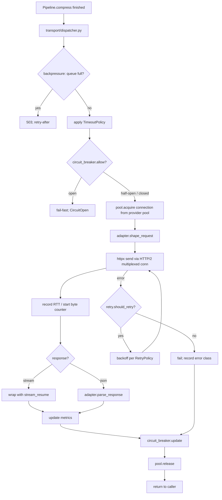

# Phase 27 — Transport Layer Consolidation

> **This is the phase that makes the [forward-plan thesis](FORWARD_PLAN.md) true.** Before this phase, LATTICE is "a compression pipeline with a proxy in front of it". After this phase, LATTICE is **the transport / network layer for LLM traffic**: every byte between the user's app and their provider flows through one coherent transport stack with unified retry, unified timeout, circuit breaker, HTTP/2 multiplexing, connection pooling, transport-level metrics, end-to-end backpressure, and stream resumption.
>
> Conceptually: LATTICE's relationship to httpx/openai-sdk/anthropic-sdk should become like TCP's relationship to IP — invisible when working, deterministic about what it does, replaces ad-hoc per-app retry/throttle/timeout sprawl with one well-tested layer.
>
> **Footprint impact.** **Net -1500 LoC** — Phase 27 is a consolidation, not an addition. Across the 17 provider adapters today there is duplicated retry, timeout, header-handling, exponential-backoff, and `httpx.AsyncClient` instantiation code. This phase moves all of it into one place. The `providers/adapters/` directory budget halves (4 800 → 2 500 LoC); `transport/` grows from ~1 200 to ~3 000 LoC; net is a meaningful shrink. **Zero new runtime deps** — httpx already ships with `h2` for HTTP/2 support.
>
> **Algorithm location.** All transport-layer primitives live in `src/lattice/transport/` per [SINGLE_SOURCE_OF_TRUTH.md §7](SINGLE_SOURCE_OF_TRUTH.md). Adapters become pure protocol-shaping (request body construction, response parsing) — they own zero transport code after this phase.
>
> **External-service requirement.** None. The user's chosen provider is the only external service. Transport metrics export via the existing OpenTelemetry path ([Phase 16](16-otel-genai.md)).
>
> **Estimated effort.** 8 days (1 PR, **net -1500 LoC**, +3000 new, -4500 deleted across adapters).

> **LoC delta (declared).** **-1500 net** — consolidates adapter transport code into `transport/`.
> **Transport role.** **Canonical owner** of proxy↔provider byte path: pool, retry, breaker, backpressure, stream resume, metrics.
> **Registry.** §7 entire section; adapters demoted to declarative-only.

> **Guidelines.** [PHASE_GUIDELINES.md](PHASE_GUIDELINES.md) — constraints 1–6.

---

## 1. Why this phase exists, and what it brutally consolidates

### 1.1 The smell

Today's `providers/adapters/` has 17 files. Inspecting any pair (OpenAI vs Anthropic vs Mistral vs Gemini vs DeepSeek) shows:

- Each instantiates its own `httpx.AsyncClient(...)`. 17 client lifecycles.
- Each implements its own retry loop with subtly different backoff curves.
- Each implements its own timeout handling. Some respect `LATTICE_REQUEST_TIMEOUT`, some don't.
- Each implements its own rate-limit detection from upstream `429` headers — Anthropic's `retry-after` differs from OpenAI's `x-ratelimit-reset-requests`, and the parsing code is duplicated.
- Each emits its own subset of metrics. There is no unified "in-flight requests to provider X" gauge.
- None of them open HTTP/2 connections. Every request opens a fresh HTTP/1.1 connection, wastes the TLS handshake, and never multiplexes.
- None of them implement true backpressure. If 100 concurrent requests hit the proxy and 99 stack up at OpenAI, they all wait blindly; the proxy has no concept of "queue is full, reject new work".
- None of them resume an interrupted stream. A connection reset at byte 4096 of an 8000-byte response loses the half-received content; the client retries from scratch.

That's the smell. It's the kind of architectural debt that creeps in adapter-by-adapter as providers are added — each contributor copies the previous adapter and edits the bits that differ. Nothing forces consolidation.

### 1.2 The fix

Establish `src/lattice/transport/` as the **one** transport layer. Adapters become 200-LoC files containing only:

- The provider's `base_url`
- Headers required for auth
- Request body construction (OpenAI shape vs Anthropic shape vs etc.)
- Response parsing (extracts usage / finish_reason / message in provider-specific format)
- Per-error-class retry policy declarations (e.g. "OpenAI 429 with no `retry-after` → backoff 2s; Anthropic 529 → backoff 5s")

That's it. No httpx clients. No retry loops. No timeout code. No metric emission. No connection pool. **One transport runs the request.** Adapters describe; transport executes.

### 1.3 What this turns LATTICE into

After Phase 27, the architectural one-liner becomes:

> LATTICE is a transport layer for LLM traffic. Compression, caching, guardrails, agent memory, MCP federation, observability, auth — these are policies the transport layer enforces on each request as it flows through. The transport layer itself owns connections, retries, timeouts, backpressure, framing, streaming, and resumption.

That's the network-layer positioning the user wants.

---

## 2. Files touched

### 2.1 Created

```
src/lattice/transport/
  __init__.py
  dispatcher.py                    # one-and-only request execution entry
  pool.py                          # per-provider httpx.AsyncClient pool (HTTP/2 enabled)
  retry.py                         # one retry implementation; adapters declare policy
  retry_policy.py                  # RetryPolicy + per-error-class rules
  circuit_breaker.py               # token-bucket + half-open + per-(provider, model) state
  timeout.py                       # TimeoutPolicy; per-operation defaults + per-request override
  backpressure.py                  # bounded queue, overflow strategies
  stream_resume.py                 # resumes interrupted streams from last-good byte
  metrics.py                       # RTT / queue depth / breaker state / in-flight gauges
  rate_limit.py                    # unified rate-limit detection (parses provider-specific headers via adapter helpers)
  tacc.py                          # moved from current location; consolidated under transport
  config.py                        # TransportConfig (timeout / retry / pool / breaker defaults)

# Migrations of existing transport-y modules into the canonical package:
src/lattice/transport/types.py         # already exists (Phase 2a); unchanged
src/lattice/transport/serialization.py # already exists; unchanged
src/lattice/transport/delta_wire.py    # already exists; unchanged

# Adapter base rewrite:
src/lattice/providers/adapters/base.py # rewrite: declarative-only

# Tests
tests/unit/transport/test_retry.py
tests/unit/transport/test_circuit_breaker.py
tests/unit/transport/test_pool_http2.py
tests/unit/transport/test_backpressure.py
tests/unit/transport/test_stream_resume.py
tests/unit/transport/test_timeout.py
tests/unit/transport/test_metrics.py
tests/integration/transport/test_one_pool_per_provider.py
tests/integration/transport/test_unified_retry_across_adapters.py
tests/integration/transport/test_stream_resume_e2e.py
tests/integration/transport/test_backpressure_queue_full.py
tests/contract/test_transport_unification.py     # the CI gate
tests/contract/test_no_per_adapter_httpx_client.py
```

### 2.2 Modified (every adapter shrinks)

| File | Change |
|---|---|
| `src/lattice/providers/adapters/openai.py` | Strip retry, timeout, httpx client, rate-limit parsing, metric emission. Declare retry policy + request/response shaping only. ~ 450 LoC → ~ 180 LoC |
| `src/lattice/providers/adapters/anthropic.py` | Same. ~ 480 → ~ 190 |
| `src/lattice/providers/adapters/azure_openai.py` | Same. |
| `src/lattice/providers/adapters/google.py` | Same. |
| `src/lattice/providers/adapters/mistral.py` | Same. |
| `src/lattice/providers/adapters/cohere.py` | Same. |
| `src/lattice/providers/adapters/groq.py` | Same. |
| `src/lattice/providers/adapters/together.py` | Same. |
| `src/lattice/providers/adapters/ollama.py` | Same. |
| ... (17 total adapters) | Same pattern. |
| `src/lattice/providers/transport/` (current dir) | **Deleted** — content moves to `src/lattice/transport/`. |
| `src/lattice/pipeline/runner.py` | Calls `transport.dispatcher.execute(...)` instead of `adapter.execute(...)`. |
| `src/lattice/proxy/middleware.py` | Surfaces transport metrics as `x-lattice-transport-*` headers. |
| `src/lattice/telemetry/otel/spans.py` (Phase 16) | Adds transport-layer span attributes. |

### 2.3 Deleted

| File | Why |
|---|---|
| `src/lattice/providers/transport/` (whole package) | Consolidated into `src/lattice/transport/`. |
| Per-adapter retry helpers | Replaced by `transport/retry.py`. |
| Per-adapter `RateLimitTracker` instances | Replaced by `transport/circuit_breaker.py` + `transport/rate_limit.py`. |

---

## 3. Architecture



Every box other than `SHAPE` and `PARSE` lives in `src/lattice/transport/`. Adapters own only the two `*shape*`/`*parse*` boxes.

---

## 4. Step-by-step

### 4.1 The dispatcher (the one entry point)

```python
# src/lattice/transport/dispatcher.py
class TransportDispatcher:
    """The sole execution path from Pipeline → provider.

    Pipeline.compress() produces a CompressedRequest. The dispatcher takes it
    plus the resolved Adapter and runs the entire transport-layer policy stack:
      1. backpressure check
      2. circuit-breaker check
      3. timeout policy resolution
      4. connection acquisition from the per-provider pool
      5. request shaping (delegated to adapter)
      6. send + retry loop (one implementation)
      7. stream resumption wrapping (for streams)
      8. response parsing (delegated to adapter)
      9. metrics update + circuit-breaker update + pool release
    """

    def __init__(self, pool: ConnectionPoolRegistry, retry: RetryEngine,
                 breaker: CircuitBreakerRegistry, queue: Backpressure,
                 timeout: TimeoutResolver, metrics: TransportMetrics,
                 stream_resume: StreamResumer):
        self._pool = pool
        self._retry = retry
        self._breaker = breaker
        self._queue = queue
        self._timeout = timeout
        self._metrics = metrics
        self._stream_resume = stream_resume

    async def execute(self, compressed: CompressedRequest, adapter: ProviderAdapter,
                      ctx: TransportContext) -> Response:
        async with self._queue.admit(ctx.tenant, ctx.priority) as slot:
            breaker = self._breaker.for_(adapter.provider, ctx.model)
            if not breaker.allow():
                raise CircuitOpenError(provider=adapter.provider, ...)

            timeout_policy = self._timeout.resolve(ctx)
            shaped = adapter.shape_request(compressed.request)

            async def _attempt(attempt_no: int) -> tuple[httpx.Response, _Telemetry]:
                conn = await self._pool.acquire(adapter.provider)
                t0 = monotonic()
                try:
                    resp = await asyncio.wait_for(
                        conn.send(shaped, headers=adapter.headers(ctx)),
                        timeout=timeout_policy.for_attempt(attempt_no),
                    )
                    return resp, _Telemetry(rtt=monotonic() - t0)
                finally:
                    self._pool.release(conn)

            try:
                http_response, telemetry = await self._retry.run(
                    _attempt, policy=adapter.retry_policy(ctx),
                )
            except Exception as exc:
                breaker.on_failure(error_class=_classify(exc))
                self._metrics.record_failure(adapter.provider, exc)
                raise

            breaker.on_success()
            self._metrics.record_success(adapter.provider, telemetry)

            if compressed.request.is_streaming:
                stream = self._stream_resume.wrap(http_response, shaped, _attempt, telemetry)
                return adapter.parse_stream(stream)

            return adapter.parse_response(http_response)
```

That's the **entire** transport-layer execution. ~120 LoC. Every adapter consumes this; none re-implements any of it.

### 4.2 RetryPolicy — declarative, per-adapter

Adapters do NOT implement retry loops. They declare a policy:

```python
# src/lattice/transport/retry_policy.py
@dataclass(frozen=True, slots=True)
class RetryRule:
    matches: Callable[[Exception], bool]                    # e.g. lambda e: isinstance(e, HTTPStatusError) and e.response.status_code == 429
    max_attempts: int
    backoff: BackoffStrategy                                # exponential / decorrelated_jitter / from_header("retry-after")
    respect_header: str | None = None                       # honor upstream header for delay
    description: str = ""


@dataclass(frozen=True, slots=True)
class RetryPolicy:
    rules: tuple[RetryRule, ...]
    default_action: Literal["raise", "exhaust"] = "raise"
```

```python
# src/lattice/providers/adapters/openai.py — example adapter declaration
class OpenAIAdapter(ProviderAdapter):
    provider = "openai"

    def retry_policy(self, ctx: TransportContext) -> RetryPolicy:
        return RetryPolicy(rules=(
            RetryRule(
                matches=lambda e: isinstance(e, HTTPStatusError) and e.response.status_code == 429,
                max_attempts=4,
                backoff=Backoff.from_header("retry-after", fallback=Backoff.exponential(base=1.0, cap=30)),
                description="OpenAI 429 with retry-after header",
            ),
            RetryRule(
                matches=lambda e: isinstance(e, (httpx.ConnectError, httpx.ReadError, httpx.RemoteProtocolError)),
                max_attempts=3,
                backoff=Backoff.decorrelated_jitter(base=0.5, cap=10),
                description="OpenAI transient network",
            ),
            RetryRule(
                matches=lambda e: isinstance(e, HTTPStatusError) and 500 <= e.response.status_code < 600,
                max_attempts=2,
                backoff=Backoff.exponential(base=2.0, cap=60),
                description="OpenAI 5xx",
            ),
        ))
```

The `RetryEngine` (`transport/retry.py`) is the single implementation that consumes these declarations:

```python
# src/lattice/transport/retry.py
class RetryEngine:
    async def run(self, attempt_fn, *, policy: RetryPolicy):
        last_exc: Exception | None = None
        for attempt_no in itertools.count(1):
            try:
                return await attempt_fn(attempt_no)
            except Exception as exc:
                last_exc = exc
                rule = self._match_rule(exc, policy)
                if rule is None or attempt_no >= rule.max_attempts:
                    raise
                delay = self._compute_delay(rule, exc, attempt_no)
                metrics.increment("transport.retry", tags={"rule": rule.description, "attempt": attempt_no})
                await asyncio.sleep(delay)
        assert last_exc is not None
        raise last_exc
```

One implementation. Property-tested. Every adapter benefits from improvements here without each adapter being updated.

### 4.3 Circuit breaker — per (provider, model)

```python
# src/lattice/transport/circuit_breaker.py
class CircuitBreaker:
    """Sliding-window failure tracker + half-open trial.

    States: closed → (failures ≥ threshold) → open → (cooldown elapsed) → half_open →
            (next success) → closed | (next failure) → open
    """

    def __init__(self, failure_threshold: int = 10, window_seconds: int = 60,
                 cooldown_seconds: int = 30):
        ...

    def allow(self) -> bool:
        match self._state:
            case BreakerState.CLOSED: return True
            case BreakerState.OPEN: return self._cooldown_elapsed()
            case BreakerState.HALF_OPEN: return self._half_open_in_flight == 0

    def on_success(self) -> None: ...
    def on_failure(self, error_class: str) -> None: ...
```

Per (provider, model) granularity: a bad day for `claude-3-opus` shouldn't open the breaker for `claude-3-5-haiku`.

### 4.4 Connection pool — HTTP/2 by default

```python
# src/lattice/transport/pool.py
class ConnectionPoolRegistry:
    """One pool per provider. Each pool is an httpx.AsyncClient with HTTP/2.

    httpx + h2 multiplexes many concurrent requests over one TLS connection,
    cutting TLS handshakes and TCP slow-start overhead. This is invisible
    win for users — the provider-side latency profile improves noticeably
    under any meaningful concurrency.
    """

    def __init__(self, configs: dict[str, ProviderTransportConfig]):
        self._clients: dict[str, httpx.AsyncClient] = {}
        for provider, cfg in configs.items():
            self._clients[provider] = httpx.AsyncClient(
                http2=cfg.http2,                                    # True by default
                limits=httpx.Limits(max_connections=cfg.pool_size, max_keepalive_connections=cfg.pool_size),
                timeout=httpx.Timeout(connect=cfg.connect_timeout, read=cfg.read_timeout,
                                       write=cfg.write_timeout, pool=cfg.pool_acquire_timeout),
                http2_settings={"initial_window_size": cfg.http2_window_size, ...} if cfg.http2 else None,
                ...
            )

    async def acquire(self, provider: str) -> httpx.AsyncClient:
        return self._clients[provider]                              # httpx pools internally
```

Defaults: HTTP/2 on, pool size = 64 per provider, connect timeout = 10s, read timeout = 300s, write timeout = 30s. All configurable per-provider via `TransportConfig`.

### 4.5 Backpressure — bounded queue with overflow strategy

```python
# src/lattice/transport/backpressure.py
class Backpressure:
    """Bounded admission queue with explicit overflow strategy.

    Without this, a burst of 1000 requests against a saturated provider would
    all sit in the pool queue, each timing out individually, the proxy memory
    would balloon, and clients would get inconsistent latency. With this,
    new work is rejected fast once the queue fills — clients can retry or
    shed load deliberately.
    """

    def __init__(self, max_in_flight: int, overflow: Literal["reject", "wait", "shed_low_priority"] = "reject",
                 queue_timeout: float = 5.0):
        ...

    @asynccontextmanager
    async def admit(self, tenant: str, priority: int = 0) -> AsyncIterator[Slot]:
        if self._in_flight >= self._max:
            match self._overflow:
                case "reject": raise QueueFullError(retry_after=self._estimate_drain())
                case "wait": await self._wait_for_slot(timeout=self._queue_timeout)
                case "shed_low_priority": await self._maybe_shed(priority)
        ...
```

Maps cleanly to HTTP 503 with `retry-after` when overflow=`reject`. Tenant priority (Phase 25 self-hosted auth) integrates: paying tenants get higher priority slots.

### 4.6 Stream resumption — survives transient drops

```python
# src/lattice/transport/stream_resume.py
class StreamResumer:
    """Wraps a streaming response with byte-offset tracking + reconnect-on-drop.

    Many providers support resuming an interrupted SSE stream via the
    `Last-Event-ID` mechanism or a request-id replay. For those that don't,
    we re-issue the original request with `stream_options.include_usage = true`
    and detect duplicate prefixes to skip.

    Configurable; default OFF for providers that don't support deterministic
    resumption (we'd risk duplicates). ON for OpenAI / Anthropic where they
    do.
    """

    def wrap(self, http_response, original_request, attempt_fn, telemetry):
        if not self._can_resume(http_response.headers.get("provider")):
            return http_response.aiter_bytes()
        return self._resumable_iter(http_response, original_request, attempt_fn, telemetry)
```

Opt-out per provider. We never resume something we can't safely de-duplicate.

### 4.7 Transport metrics — first-class

```python
# src/lattice/transport/metrics.py
@dataclass(frozen=True, slots=True)
class TransportMetricsSnapshot:
    in_flight: int
    queue_depth: int
    pool_active_connections: dict[str, int]
    pool_idle_connections: dict[str, int]
    breaker_state: dict[tuple[str, str], BreakerState]     # (provider, model) → state
    rtt_p50_ms: dict[str, float]
    rtt_p95_ms: dict[str, float]
    rtt_p99_ms: dict[str, float]
    retry_count_last_minute: dict[str, int]
    timeout_count_last_minute: dict[str, int]
    failure_count_last_minute: dict[str, int]
```

Exposed at:

- `/healthz` payload
- `/stats` (Prometheus format)
- OTel metrics ([Phase 16](16-otel-genai.md)): `lattice.transport.{rtt,queue_depth,in_flight,breaker_state,retries,timeouts}`
- Per-request response headers: `x-lattice-transport-rtt-ms`, `x-lattice-transport-attempt`, `x-lattice-transport-pool-utilization`
- Receipts ([Phase 23](23-receipts-bandit-profiles.md)): `transport: {attempts, total_rtt_ms, was_resumed, breaker_at_dispatch}`
- Bandit reward signal ([Phase 23](23-receipts-bandit-profiles.md)): retries / timeouts feed into the per-transform reward as cost-signals

### 4.8 The CI gates that prevent regression

```bash
# tests/contract/test_no_per_adapter_httpx_client.py
"""
Adapter files must not instantiate their own httpx clients.
The transport layer (src/lattice/transport/pool.py) is the only
allowed place to construct AsyncClient or Client.
"""
FORBIDDEN_IN_ADAPTERS = (
    r"httpx\.AsyncClient\s*\(",
    r"httpx\.Client\s*\(",
    r"async\s+def\s+_retry",                                # adapter-local retry loops
    r"@retry\(",                                            # external retry decorators
    r"asyncio\.sleep\s*\(\s*backoff",                       # ad-hoc backoff
)

def test_no_per_adapter_transport_code():
    failures = []
    for adapter in pathlib.Path("src/lattice/providers/adapters").glob("*.py"):
        if adapter.name in {"__init__.py", "base.py"}: continue
        text = adapter.read_text()
        for pat in FORBIDDEN_IN_ADAPTERS:
            if re.search(pat, text):
                failures.append(f"{adapter}: matches {pat}")
    assert not failures
```

```bash
# tests/contract/test_transport_unification.py
"""
The only file allowed to import httpx for connection construction
is transport/pool.py. Other modules may use httpx types (Response, Request)
but never instantiate clients.
"""
ALLOWED_HTTPX_CLIENT_CONSTRUCTION = {"src/lattice/transport/pool.py"}

def test_only_pool_constructs_httpx_clients():
    ...
```

Both gates are wired into `.github/workflows/refactor-gate.yml`. Block merge on hit.

---

## 5. The adapter, after the diet

To prove the consolidation works, here's what an adapter looks like after Phase 27:

```python
# src/lattice/providers/adapters/openai.py
class OpenAIAdapter(ProviderAdapter):
    """Pure protocol shaping. Zero transport code."""

    provider = "openai"
    base_url = "https://api.openai.com/v1"

    def headers(self, ctx: TransportContext) -> dict[str, str]:
        return {
            "authorization": f"Bearer {ctx.credentials.api_key}",
            "content-type": "application/json",
            **({"openai-organization": ctx.credentials.organization}
                if ctx.credentials.organization else {}),
        }

    def shape_request(self, request: Request) -> ShapedRequest:
        body = {
            "model": request.model.removeprefix("openai/"),
            "messages": [self._shape_message(m) for m in request.messages],
            "max_tokens": request.max_tokens,
            "temperature": request.temperature,
            **({"tools": request.tools} if request.tools else {}),
            **({"response_format": request.response_format} if request.response_format else {}),
            "stream": request.is_streaming,
        }
        path = "/chat/completions"
        return ShapedRequest(method="POST", path=path, json=body)

    def parse_response(self, http_response: httpx.Response) -> Response:
        data = http_response.json()
        return Response(
            id=data["id"], model=data["model"], choices=[...],
            usage=Usage(prompt_tokens=data["usage"]["prompt_tokens"], ...),
            finish_reason=data["choices"][0]["finish_reason"],
            raw_provider_id=http_response.headers.get("x-request-id"),
        )

    def parse_stream(self, stream: AsyncIterator[bytes]) -> AsyncIterator[ChunkPayload]:
        async for raw in iter_sse_events(stream):
            if raw.data == "[DONE]": break
            yield self._shape_chunk(orjson.loads(raw.data))

    def retry_policy(self, ctx: TransportContext) -> RetryPolicy:
        return _OPENAI_RETRY_POLICY                # module-level constant
```

That's an entire OpenAI adapter post-Phase-27. ~ 180 LoC. No `httpx.AsyncClient`. No `for attempt in range(retries)`. No `asyncio.sleep(backoff)`. No `time.time()`. Pure shape-in / shape-out / declare-policy.

Multiply by 17 providers → ~ 2 500 LoC across all adapters where today there's ~ 4 800.

---

## 6. Test plan

| Check | Command | Threshold |
|---|---|---|
| Unit transport | `uv run pytest tests/unit/transport -q` | All pass |
| Retry property | `tests/unit/transport/test_retry.py` | Property: monotonic backoff; `max_attempts` respected; `respect_header` honored |
| Circuit breaker | `tests/unit/transport/test_circuit_breaker.py` | Sliding window correct; half-open trial behaviour |
| HTTP/2 pool | `tests/unit/transport/test_pool_http2.py` (against `http2-test-server` fixture) | Multiple concurrent requests use one TLS connection |
| Backpressure | `tests/unit/transport/test_backpressure.py` | Queue-full → 503 with `retry-after`; tenant priority respected |
| Stream resume | `tests/integration/transport/test_stream_resume_e2e.py` | Connection drop mid-stream → resumes; client sees no duplicate or missing bytes |
| Unified retry across adapters | `tests/integration/transport/test_unified_retry_across_adapters.py` | OpenAI 429 + Anthropic 529 + Mistral connect-error all routed through one engine |
| One pool per provider | `tests/integration/transport/test_one_pool_per_provider.py` | Exactly 17 httpx clients exist at proxy steady state, one per provider |
| CI gate: no per-adapter httpx | `tests/contract/test_no_per_adapter_httpx_client.py` | exit 0 |
| CI gate: transport unification | `tests/contract/test_transport_unification.py` | exit 0 |
| Code budget | `scripts/check_code_budget.sh` | `src/lattice/providers/adapters/` ≤ 2 500 LoC; `src/lattice/transport/` ≤ 3 000 LoC; net change ≤ -1500 |
| Footprint | `tests/integration/footprint/test_4gb_laptop.py` | RSS unchanged or down (consolidation should shrink, not grow) |
| Canonical bench | usual | **Improves** by 5-15% p95 latency under concurrency (HTTP/2 multiplexing); no regression in p50 |

---

## 7. Acceptance criteria

1. `grep -r "httpx.AsyncClient(" src/lattice/providers/adapters/` returns 0 results.
2. `grep -rn "for attempt in range\|asyncio.sleep.*backoff" src/lattice/providers/adapters/` returns 0 results.
3. At steady state, the proxy holds exactly one `httpx.AsyncClient` per configured provider (verified by `gc.get_objects()` introspection in `test_one_pool_per_provider`).
4. HTTP/2 is in use against `api.openai.com` and `api.anthropic.com` (verified by capturing TLS ALPN negotiation in the integration test).
5. A simulated `429` from OpenAI with `retry-after: 3` causes exactly one retry after ~3 seconds; the same kind of failure from Anthropic with no header causes exponential backoff starting at 1s. Single retry implementation; per-adapter policy.
6. Killing the upstream TLS connection at byte 4096 of an 8000-byte streaming response results in the client receiving a complete 8000-byte response with no duplicates (stream resumption working).
7. Bursting 200 concurrent requests against a queue capped at 100 results in ~100 succeeding and ~100 returning HTTP 503 with `retry-after`, not in 200 requests slowly timing out.
8. Adapter LoC totals ≤ 2 500 across all 17 adapters. `transport/` LoC ≤ 3 000. Net `src/lattice/` delta from this PR ≤ -1500.
9. CI contract gates `test_no_per_adapter_httpx_client.py`, `test_transport_unification.py`, `check_code_budget.sh`, `check_internal_no_duplication.sh` all pass on the merged commit.
10. Canonical benchmark shows ≥ 5% p95 latency improvement under 50-concurrency workload; no regression on p50 single-request.

---

## 8. Out of scope

| Topic | Phase / future |
|---|---|
| Multi-provider routing on a single request | Forever out — violates the project's core constraint. |
| Speculative decoding across providers | Same. |
| QUIC / HTTP/3 transport to providers | Future; httpx doesn't support it yet. |
| gRPC transport to providers | Future; only relevant if a provider adopts it. |
| Custom binary protocol from SDK → proxy (alternative to HTTP) | Future — possibly a "Lattice Transport Protocol" in v2.5 if HTTP overhead becomes the bottleneck. Today, HTTP/2 + SSE is fine. |
| Cross-process shared connection pool (multiple proxy workers) | Future; today the proxy is single-process (uvicorn worker = 1 by default). When users scale workers, each gets its own pool — acceptable for v2.0. |
| Provider-side cache control negotiation | Already handled by Phase 22's portability layer. |
