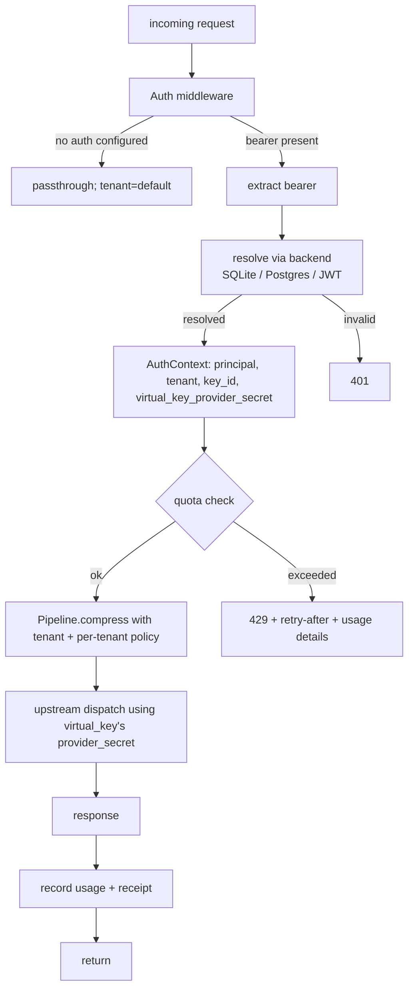

# Phase 32 — Optional Self-Hosted Auth, Virtual Keys, Quotas

> **There is no LATTICE cloud.** This phase is for small teams running **one shared self-hosted proxy** who need authentication, per-user virtual API keys, and per-key usage quotas. Everything is opt-in. Single-user laptop deployments don't touch any of this.
>
> **Footprint impact.** Default install: zero new deps, all auth features off. With `[auth]` extra: +argon2-cffi (~500 KB), +pyjwt (~100 KB), ~ 5 MB RSS. With Postgres backend (already an `[postgres]` extra from Phase 20): no additional deps. SQLite-backed state is the default when auth is enabled — no external service required.
>
> **Algorithm location.** New `src/lattice/auth/`, `src/lattice/keys/`, `src/lattice/quotas/`, `src/lattice/tenants/` modules. All reuse Phase 20's tenant namespace plumbing, [Phase 28](28-receipts.md)'s receipts, and [Phase 22](19-otel-genai.md)'s OTel spans. SDKs don't reimplement any auth logic — they pass a bearer token, the proxy does the rest.
>
> **External-service requirement.** None for SQLite backend (default). Postgres only for teams that want shared state across multiple proxy replicas. No cloud KMS, no Stripe, no managed identity provider.
>

> **Transport role.** Admission control at proxy ingress (bearer → tenant) before pipeline/transport; virtual keys supply provider credentials to dispatcher.
> **Registry.** §11 auth/multi-user.

> **Guidelines.** [PHASE_GUIDELINES.md](PHASE_GUIDELINES.md) — constraints 1–6.
> **Outcome.** A team of 5-50 engineers running one LATTICE proxy on a shared VPS can:
> - Generate per-engineer virtual API keys without giving them the real provider key
> - Set per-key spend / token / rate caps
> - See per-engineer usage in a built-in `/lattice/usage` HTML page (off by default, opt-in for trusted networks)
> - Audit who-did-what via signed receipts ([Phase 28](28-receipts.md))
> - Rotate virtual keys without touching the provider key
>
> No SaaS, no cloud, no Stripe, no Terraform. Just a binary running on a server you own.
>
> **Estimated effort.** 6 days (1 PR, ~+3000 LoC — massively smaller than prior because we dropped cloud infra, Stripe, distillation, playground).

---

## 1. Why this phase exists, and what brutally changed from the prior draft

### 1.1 What the prior draft proposed

The prior draft was effectively a SaaS pivot:

- Hosted `lattice.cloud` with Cloudflare Workers in front of FastAPI
- Neon Postgres as primary DB
- Upstash Redis for shared cache
- Stripe-billed plans (Free / Starter / Pro / Enterprise) with auto-charged overages
- Per-tenant LoRA fine-tuning ("distillation") pipeline with GPU + corpora storage
- Hosted playground at `/lattice/playground`
- Terraform IaC for managed deployment

That's a different company. You don't want it.

### 1.2 What survives

The same primitives — auth, virtual keys, quotas, tenant isolation — are genuinely useful for the **self-hosted shared-proxy** case (a team running one proxy on a VPS for everyone to use). All those features ship in this phase as **opt-in self-hosted only**, with:

- SQLite as the default backend (zero external services)
- Postgres as an opt-in upgrade for multi-replica deployments
- No Stripe, no hosted offering, no cloud-only flows
- No distillation training pipeline (Phase 28's bandit covers the value with zero infra)
- No hosted playground (the `lattice` CLI ships a local-only debug page in [Phase 34](34-agent-loop-aware.md), gated behind `--debug-ui` and bound to 127.0.0.1)

### 1.3 The brutal honest summary

This is a **small** phase, despite touching many files. It exists because real users running multi-engineer teams need it. It does not exist because LATTICE needs to become a SaaS.

If you're a single user on a laptop, skip this entire phase. Everything in M2, M3, and the rest of M4 works without any of this.

---

## 2. Files touched

### 2.1 Created

```
src/lattice/auth/__init__.py
src/lattice/auth/middleware.py                 # FastAPI middleware: bearer extract → AuthContext
src/lattice/auth/context.py                    # AuthContext: principal, tenant, capabilities
src/lattice/auth/backends/__init__.py
src/lattice/auth/backends/base.py
src/lattice/auth/backends/sqlite.py            # DEFAULT — single-file DB at ~/.lattice/auth.db
src/lattice/auth/backends/postgres.py          # OPT-IN — multi-replica
src/lattice/auth/backends/jwt_external.py      # OPT-IN — for teams with existing OIDC
src/lattice/auth/admin_cli.py                  # `lattice user|key|quota ...` subcommands

src/lattice/keys/__init__.py
src/lattice/keys/manager.py                    # mint, rotate, revoke
src/lattice/keys/encryption.py                 # encrypt provider secrets at rest (Fernet)
src/lattice/keys/redaction.py                  # never log key material

src/lattice/quotas/__init__.py
src/lattice/quotas/limiter.py                  # token bucket + monthly aggregate
src/lattice/quotas/cost_estimator.py           # delegates to telemetry/cost_estimator.py
src/lattice/quotas/policies.py                 # ratelimit / hard-cap / soft-cap

src/lattice/tenants/__init__.py
src/lattice/tenants/policy.py                  # per-tenant overrides for cache / guardrails / agent-memory
src/lattice/tenants/usage.py                   # rollups: hourly / daily / monthly

src/lattice/proxy/admin_routes.py              # /lattice/admin/{users,keys,quotas,usage} JSON API
src/lattice/proxy/admin_ui.py                  # minimal HTML page; OFF by default

migrations/sqlite/                             # raw .sql versions
migrations/postgres/                           # idempotent .sql; alembic optional

tests/unit/auth/test_sqlite_backend.py
tests/unit/auth/test_jwt_external.py
tests/unit/keys/test_manager.py
tests/unit/keys/test_encryption.py
tests/unit/quotas/test_limiter.py
tests/unit/tenants/test_policy.py
tests/integration/admin/test_admin_cli.py
tests/integration/admin/test_admin_api.py
tests/integration/auth/test_multi_user_isolation.py
tests/contract/test_default_install_no_auth_required.py
```

### 2.2 Modified

| File | Change |
|---|---|
| [src/lattice/proxy/server.py](../../src/lattice/proxy/server.py) | Conditionally mount auth middleware + admin routes when auth enabled |
| [src/lattice/proxy/middleware.py](../../src/lattice/proxy/middleware.py) | Stash `request.state.auth: AuthContext` |
| [src/lattice/cache/namespace.py](../../src/lattice/cache/namespace.py) | Use `auth.tenant` when present; falls back to header / default |
| [src/lattice/telemetry/cost_estimator.py](../../src/lattice/telemetry/cost_estimator.py) | Report per-tenant + per-key aggregates |
| [src/lattice/cli/__init__.py](../../src/lattice/cli/__init__.py) | Register `user`, `key`, `quota`, `usage` subcommands |
| [pyproject.toml](../../pyproject.toml) | Optional `auth = ["argon2-cffi>=23.0", "pyjwt[crypto]>=2.8", "cryptography>=43.0"]` |
| [docs/getting-started/quickstart.md](../../docs/getting-started/quickstart.md) | Add "Multi-user self-hosted" section |

### 2.3 Explicitly NOT in this phase

| Topic | Why not |
|---|---|
| `lattice.cloud` hosted offering | Open-source self-hosted only |
| Stripe billing | No SaaS |
| Cloudflare Workers / Neon / Upstash Terraform | Open-source self-hosted only |
| Per-tenant LoRA distillation training | Requires GPU + cloud infra; bandit ([Phase 28](28-receipts.md)) covers 80% of value with zero infra |
| Hosted playground | Local debug UI in [Phase 34](34-agent-loop-aware.md); not internet-facing |
| Email-based magic link sign-in | Out of scope; teams have existing SSO |
| Audit-log export to S3 / GCS | Use the existing OTel + receipts integration; cloud-specific exporters out of scope |

---

## 3. Architecture



Key idea: **virtual keys** decouple the per-engineer credential from the real provider credential. Alice's virtual key `vk_abc123` resolves to OpenAI API key `sk-real-...` stored encrypted in the DB. Alice never sees the real key; she can be revoked instantly without rotating the real provider key.

---

## 4. Step-by-step

### 4.1 Auth backends — SQLite default

```python
# src/lattice/auth/backends/sqlite.py
class SQLiteAuthBackend:
    """Single-file backend at ~/.lattice/auth.db. Default when auth is enabled.

    Suitable for:
      - Single-server deployments
      - Up to ~ 200 active users / 1k virtual keys
      - Read-heavy workloads

    For multi-replica deployments, use the Postgres backend.
    """

    def __init__(self, db_path: Path | None = None):
        self._path = db_path or (Path.home() / ".lattice" / "auth.db")
        self._path.parent.mkdir(parents=True, exist_ok=True)
        self._conn = sqlite3.connect(self._path, check_same_thread=False,
                                      isolation_level=None)
        self._conn.execute("PRAGMA journal_mode=WAL")
        self._conn.execute("PRAGMA foreign_keys=ON")
        self._run_migrations()

    def resolve_bearer(self, bearer: str) -> AuthContext | None:
        # bearer format: vk_<base32>  for virtual keys
        # bearer format: <jwt>        for external JWT (different backend)
        if not bearer.startswith("vk_"):
            return None
        key_hash = _hash_bearer(bearer)
        row = self._conn.execute(
            "SELECT k.id, k.user_id, k.tenant_id, k.encrypted_provider_secret, "
            "       k.revoked, u.email "
            "FROM virtual_keys k JOIN users u ON k.user_id = u.id "
            "WHERE k.bearer_hash = ?",
            (key_hash,),
        ).fetchone()
        if row is None or row[4]:                       # not found / revoked
            return None
        return AuthContext(
            principal=Principal(user_id=row[1], email=row[5]),
            tenant=row[2],
            key_id=row[0],
            provider_secret=_decrypt(row[3]),
        )
```

Schema (migrations/sqlite/001_init.sql):

```sql
CREATE TABLE IF NOT EXISTS users (
  id INTEGER PRIMARY KEY AUTOINCREMENT,
  email TEXT NOT NULL UNIQUE,
  display_name TEXT,
  password_argon2 TEXT,                                 -- nullable: SSO-only users
  role TEXT NOT NULL DEFAULT 'member' CHECK (role IN ('admin', 'member')),
  created_at INTEGER NOT NULL,
  disabled_at INTEGER
);

CREATE TABLE IF NOT EXISTS tenants (
  id TEXT PRIMARY KEY,                                  -- short slug
  display_name TEXT NOT NULL,
  created_at INTEGER NOT NULL
);

CREATE TABLE IF NOT EXISTS virtual_keys (
  id TEXT PRIMARY KEY,                                  -- vk_id (NOT the bearer)
  user_id INTEGER NOT NULL REFERENCES users(id),
  tenant_id TEXT NOT NULL REFERENCES tenants(id),
  bearer_hash TEXT NOT NULL UNIQUE,                     -- sha256 of bearer; bearer is shown once at mint time
  encrypted_provider_secret BLOB NOT NULL,              -- Fernet-encrypted
  provider TEXT NOT NULL,                               -- openai|anthropic|...
  label TEXT,
  expires_at INTEGER,
  revoked INTEGER NOT NULL DEFAULT 0,
  created_at INTEGER NOT NULL
);

CREATE TABLE IF NOT EXISTS quotas (
  id INTEGER PRIMARY KEY AUTOINCREMENT,
  scope TEXT NOT NULL CHECK (scope IN ('key', 'user', 'tenant')),
  scope_id TEXT NOT NULL,
  kind TEXT NOT NULL CHECK (kind IN ('tokens_per_min', 'requests_per_min',
                                       'tokens_per_month', 'usd_per_month')),
  limit_value REAL NOT NULL,
  action TEXT NOT NULL DEFAULT 'reject' CHECK (action IN ('reject', 'throttle', 'warn')),
  created_at INTEGER NOT NULL,
  UNIQUE (scope, scope_id, kind)
);

CREATE TABLE IF NOT EXISTS usage_records (
  ts INTEGER NOT NULL,                                  -- unix seconds, bucketed (15-min)
  tenant_id TEXT NOT NULL,
  user_id INTEGER,
  key_id TEXT,
  provider TEXT NOT NULL,
  model TEXT NOT NULL,
  requests INTEGER NOT NULL,
  prompt_tokens INTEGER NOT NULL,
  completion_tokens INTEGER NOT NULL,
  cached_tokens INTEGER NOT NULL,
  estimated_usd REAL NOT NULL,
  PRIMARY KEY (ts, tenant_id, user_id, key_id, provider, model)
);
```

### 4.2 Auth backends — JWT (external SSO)

For teams with existing OIDC / SAML:

```python
# src/lattice/auth/backends/jwt_external.py
class JWTAuthBackend:
    """Validates externally-issued JWTs (Okta, Auth0, Keycloak, Google Workspace, etc.).

    Configured with the issuer's JWKS URL; pyjwt validates signatures.
    Tenant/user mapping comes from a configurable claim (default: 'tenant').
    Virtual-key provider secrets still live in our DB, keyed by user_id from the JWT 'sub'.
    """

    def __init__(self, jwks_url: str, audience: str, *, tenant_claim: str = "tenant"):
        self._jwks_url = jwks_url
        self._audience = audience
        self._tenant_claim = tenant_claim
        self._jwks = _refreshing_jwks(jwks_url)

    def resolve_bearer(self, bearer: str) -> AuthContext | None:
        try:
            claims = jwt.decode(bearer, key=self._jwks.public_key_for(bearer),
                                algorithms=["RS256"], audience=self._audience)
        except jwt.InvalidTokenError:
            return None
        ...
```

### 4.3 Virtual key minting

```python
# src/lattice/keys/manager.py
class KeyManager:
    BEARER_PREFIX = "vk_"

    def mint(self, *, user_id: int, tenant_id: str, provider: str,
             provider_secret: str, label: str | None = None,
             expires_at: datetime | None = None) -> MintResult:
        bearer = self._generate_bearer()                # vk_<32 base32 chars>
        bearer_hash = _hash_bearer(bearer)
        key_id = f"vk_{_generate_id(prefix_len=12)}"
        encrypted = _encrypt(provider_secret)
        self._backend.insert_key(
            id=key_id, user_id=user_id, tenant_id=tenant_id,
            bearer_hash=bearer_hash, encrypted_provider_secret=encrypted,
            provider=provider, label=label, expires_at=expires_at,
        )
        return MintResult(id=key_id, bearer=bearer, label=label)
        # bearer returned ONCE; never stored in plaintext; never logged
```

Bearer format: `vk_` + 32 url-safe base64 chars (192 bits of entropy). Hash with SHA-256 before persisting. Only the hash lives in the DB.

Encryption key: Fernet, derived from `LATTICE_KEY_ENCRYPTION_KEY` env var (32 bytes base64). Documented in operations guide. CLI subcommand `lattice key rotate-encryption-key` re-encrypts all rows under a new key with online migration.

### 4.4 Quotas

```python
# src/lattice/quotas/limiter.py
class QuotaLimiter:
    """Token-bucket rate limits + monthly aggregate limits.

    Per-key, per-user, per-tenant scopes. Sub-100µs check via in-memory cache
    backed by SQLite/Postgres for persistence.
    """

    def check(self, ctx: AuthContext, request_estimate: RequestEstimate) -> QuotaCheckResult:
        scopes = (("key", ctx.key_id), ("user", ctx.principal.user_id), ("tenant", ctx.tenant))
        for scope, scope_id in scopes:
            for limit in self._limits_for(scope, scope_id):
                if not self._would_fit(limit, ctx, request_estimate):
                    return QuotaCheckResult(allowed=False, limit=limit, retry_after=self._retry_after(limit))
        return QuotaCheckResult.allowed()
```

Quota kinds:

- `tokens_per_min` (token bucket: rate + burst)
- `requests_per_min` (token bucket)
- `tokens_per_month` (sliding window over 30 days; calendar-month variant via config)
- `usd_per_month` (uses [Phase 6](06-providers-credentials.md)'s cost estimator)

Actions: `reject` (429), `throttle` (insert delay until refill), `warn` (allow + warning header).

### 4.5 Per-tenant policy overrides

```python
# src/lattice/tenants/policy.py
@dataclass(frozen=True, slots=True)
class TenantPolicy:
    cache: CacheConfig | None = None              # overrides for Phase 20
    guardrails: GuardrailConfig | None = None     # overrides for Phase 21
    agent_memory: AgentMemoryConfig | None = None # overrides for Phase 34
    quotas: tuple[Quota, ...] = ()
    profile: str | None = None                    # named profile from Phase 28
    receipts_required: bool = False               # if True, every request gets a receipt
```

Tenant policy is fetched at request time from the backend, cached in-memory for 60 s, invalidated by admin write. SDKs send the bearer; the proxy resolves everything else.

### 4.6 Admin CLI

```
$ lattice user create alice@example.com --role admin
$ lattice key mint --user alice@example.com --tenant team-a --provider openai \
                   --provider-key sk-real-... --label "Alice laptop"
Bearer (shown once): vk_<base32 32 chars>
Key ID: vk_a1b2c3d4e5f6

$ lattice quota set --user alice@example.com --kind usd_per_month --limit 50 --action reject
$ lattice quota set --tenant team-a --kind tokens_per_min --limit 100000 --action throttle

$ lattice key list --user alice@example.com
$ lattice key revoke vk_a1b2c3d4e5f6
$ lattice usage report --tenant team-a --range 30d
```

All commands talk to the same backend the proxy uses. Single-binary admin; no separate service.

### 4.7 Admin HTTP API (machine-readable)

`/lattice/admin/{users,keys,quotas,usage}` — JSON REST. Requires the bearer to belong to a user with `role = admin`. Documented in OpenAPI ([Phase 24](20-typescript-sdk.md)) so the same generated TS / Python types apply.

### 4.8 Minimal admin UI

A single static HTML page served at `/lattice/admin/ui` shows users, keys, quotas, current-month usage with sortable tables. **Off by default.** Enabled with `--admin-ui` and **bound to 127.0.0.1 only** unless the operator explicitly passes `--admin-ui-bind 0.0.0.0` (which the proxy logs prominently as a security warning at every startup).

No JavaScript framework. ~ 600 lines of vanilla JS + CSS. Ships in the wheel; no npm.

### 4.9 Receipts integration

Every request that touches an authenticated context produces a receipt ([Phase 28](28-receipts.md)) that records:

- `tenant_id`, `user_id`, `key_id`
- Compressed/uncompressed tokens, cache layer hit, guardrail violations
- Upstream provider request ID, estimated USD
- HMAC-signed for tamper evidence

Receipts are stored in the same backend (SQLite or Postgres). Retention TTL configurable (default 90 days).

### 4.10 Defaults that keep single-user laptops untouched

```python
# src/lattice/core/config.py
class AuthConfig(BaseModel):
    enabled: bool = False                              # OFF — single-user laptops unaffected
    backend: Literal["sqlite", "postgres", "jwt"] = "sqlite"
    backend_options: dict[str, str] = Field(default_factory=dict)
    require_bearer: bool = True                        # when enabled, refuse anonymous
    admin_api_enabled: bool = True                     # when auth is enabled
    admin_ui_enabled: bool = False                     # OFF by default
    admin_ui_bind: str = "127.0.0.1"                   # local only when enabled
```

Lean-install contract test (`tests/contract/test_default_install_no_auth_required.py`) confirms: default install, no env vars, the proxy boots, accepts requests with no bearer, and never touches any auth code path.

---

## 5. Test plan

| Check | Command | Threshold |
|---|---|---|
| Unit auth | `uv run pytest tests/unit/auth tests/unit/keys tests/unit/quotas tests/unit/tenants -q` | All pass |
| SQLite backend | `tests/unit/auth/test_sqlite_backend.py` | CRUD + concurrent reads + WAL rollback |
| JWT backend | `tests/unit/auth/test_jwt_external.py` | Signature validation; clock skew tolerance; JWKS refresh |
| Key encryption | `tests/unit/keys/test_encryption.py` | Provider secret never appears in any persisted column nor any log line |
| Quota correctness | `tests/unit/quotas/test_limiter.py` | Token-bucket refills correctly; monthly windows roll over |
| Admin CLI | `tests/integration/admin/test_admin_cli.py` | All subcommands work end-to-end against a temp SQLite DB |
| Admin API | `tests/integration/admin/test_admin_api.py` | Non-admin bearer → 403; admin bearer → 200 |
| Multi-user isolation | `tests/integration/auth/test_multi_user_isolation.py` | Two users' keys never see each other's cache hits; receipts attribute correctly |
| Default-install-no-auth-required | `tests/contract/test_default_install_no_auth_required.py` | Boots with empty config; serves requests with no bearer |
| Footprint default | `tests/integration/footprint/test_4gb_laptop.py` | Default install unaffected by this phase |
| Footprint with auth enabled | manual | +5 MB RSS |

---

## 6. Acceptance criteria

1. With default config (auth disabled), the proxy boots without any new file (`~/.lattice/auth.db` not created), accepts requests with no bearer, and the entire `src/lattice/auth/` module remains unimported in production code paths. Contract test enforces.
2. With `auth.enabled = true` and SQLite backend, `lattice user create` → `lattice key mint` → `curl -H 'authorization: bearer vk_...' ...` works end-to-end against the proxy.
3. Two different virtual keys from two different users in two different tenants make identical paraphrased requests → no cross-tenant cache hit. Verified by `test_multi_user_isolation`.
4. `lattice quota set` followed by exhausting that quota returns 429 with `retry-after` header populated.
5. Per-tenant policy override (e.g. tenant A has guardrails `block`, tenant B has `warn`) produces the configured behaviour. Verified by E2E test.
6. JWT backend validates a token signed by a JWKS-published public key, extracts user + tenant from configured claims, and works against a fake OIDC issuer fixture.
7. Provider secrets never appear in any log line, any OTel span attribute, any receipt, or any HTTP response. Property test grep-checks all sinks.
8. Admin UI bound to `0.0.0.0` logs a prominent warning at every proxy startup and refuses to enable if `auth.enabled = false`.
9. Default install size and footprint unchanged. With `[auth]` extra, install +1 MB, idle RSS +5 MB.
10. Canonical bench ±2%.

---

## 7. Out of scope

| Topic | Why not |
|---|---|
| Hosted `lattice.cloud` | Open-source self-hosted only |
| Stripe billing | No SaaS |
| Cloudflare Workers / Neon / Upstash Terraform | Open-source self-hosted only |
| Per-tenant LoRA distillation training | Requires GPU + cloud infra; bandit ([Phase 28](28-receipts.md)) covers value with zero infra |
| Per-tenant ML personalization | Same — cut for the same reason |
| Hosted playground | Local `--debug-ui` in [Phase 34](34-agent-loop-aware.md) instead |
| Web-based password reset / magic links | Teams use existing SSO via JWT backend |
| Audit log push to S3/GCS/BigQuery | Existing OTel + receipt store covers; cloud-specific exporters out of scope |
| Multi-region active-active | Out of scope — open-source self-hosted target is single-region |
| Kubernetes operator | Out of scope — Docker image runs anywhere; Helm not packaged ([Phase 34](34-agent-loop-aware.md)) |
