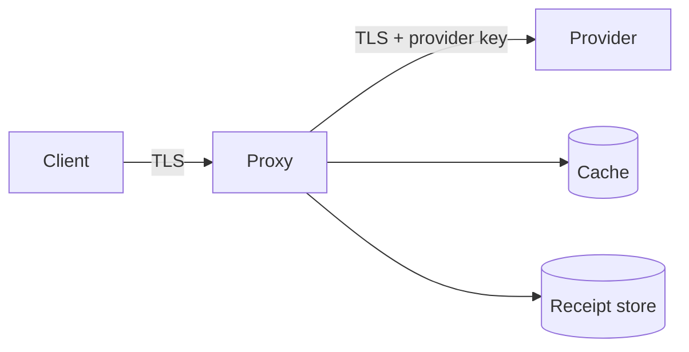

# Phase 33 — Threat Model

> **Status:** Skeleton — assets/adversaries/mitigations + contract tests land in this phase's implementation PR. & Credential Boundary

> **Footprint impact.** Doc-only + tests; 0 `src/lattice/` LoC delta; +600 LoC contract/audit tests.
> **Algorithm location.** `docs/refactor/33-threat-model.md` (this doc); CI gates in `tests/contract/test_header_allowlist.py`, `test_log_redaction.py`, `test_receipt_replay.py`.
> **External-service requirement.** None.
> **Transport role.** Maps mitigations to Phase 20 `transport.request_id`, Phase 22 cache scope keys, Phase 26 guardrails, Phase 28 receipt nonces.
> **Guidelines.** [PHASE_GUIDELINES.md](PHASE_GUIDELINES.md) — constraints 1–6.
>
> **Goal.** Explicit, reviewable threat model for a proxy on the credential path.
> **Outcome.** Assets/adversaries diagram, per-feature analysis, mitigation map to shipped phases, CI gates.
> **Estimated effort.** 3 days (1 PR).

---

## 1. Assets and adversaries

**Assets:** user prompts, API keys, alias tables, cache entries, receipts, telemetry exports.

**Adversary classes:** curious tenant, compromised client, network observer (user↔proxy), network observer (proxy↔provider), malicious upstream, compromised operator, supply-chain.

---

## 2. Trust boundaries

Credentials live only in env/files loaded by `LatticeConfig.from_env` / `from_file` (Phase 19). Logs never contain bearer tokens (middleware redaction, Phase 19 single emitter).

---

## 3. Per-feature analysis

| Feature | Threat | Mitigation phase |
|---|---|---|
| Semantic cache | Cross-tenant leakage via shared key | Phase 24 namespace + auth principal in key |
| Receipts | Replay / forgery | Phase 28 nonce + HMAC; Phase 20 request_id binding |
| Compression timing | Side-channel on content class | Phase 19 guard sampling only; no secret-dependent branches in hot path |
| Telemetry export | PII in spans | Phase 27 sanitization attributes |
| Alias table | Secret persistence | Phase 26 in-memory default; opt-in persist flag |
| Headers | Credential reflection | Phase 19 `proxy/middleware.py` allowlist |

---

## 4. CI gates

- Log-scrape regression: no credential regex in fixture logs.
- Header allowlist contract: only `x-lattice-*` from middleware.
- Receipt replay test: rejected without valid nonce/signature.

---

## 5. Out of scope

Physical host attacks, kernel CVEs, user mishandling of their own provider keys.
